# zzadmin_web - 通用后台管理系统前端

## 项目概述
zzadmin_web 是一个基于 Vue 3 + Vite 构建的现代化后台管理系统前端，提供了丰富的管理功能和友好的用户界面，可与后端管理系统进行无缝集成。

## 技术栈
- **框架**: Vue 3 (Composition API)
- **构建工具**: Vite
- **UI组件库**: Element Plus
- **路由**: Vue Router
- **状态管理**: Pinia
- **HTTP客户端**: Axios
- **样式预处理**: SCSS

## 主要功能
- 用户认证与授权管理
- 部门、角色、权限管理
- 菜单和按钮权限控制
- 操作日志记录与查询
- 定时任务管理与日志查看
- 文件上传与管理
- 数据字典管理
- 系统监控与统计
- 多语言支持
- 响应式布局，适配不同设备

## 安装与启动

### 环境要求
- Node.js >= 16.0.0
- npm >= 7.0.0 或 yarn >= 1.22.0

### 安装依赖
```bash
# 使用 npm
npm install

# 或使用 yarn
yarn install
```

### 开发模式
```bash
# 使用 npm
npm run dev

# 或使用 yarn
yarn dev
```
开发服务器启动后，可通过 http://localhost:5173 访问

### 构建生产版本
```bash
# 使用 npm
npm run build

# 或使用 yarn
yarn build
```
构建后的文件将生成在 `dist` 目录中

## 项目结构
```
src/
├── api/              # API请求封装
├── assets/           # 静态资源（图片、样式等）
├── components/       # 公共组件
│   └── WorkflowDesigner/  # 工作流设计器组件
├── composables/      # 组合式函数
├── config/           # 配置文件
├── router/           # 路由配置
├── store/            # 状态管理
├── tests/            # 测试文件
├── utils/            # 工具函数
│   ├── api/          # API请求封装
│   └── common/       # 通用工具
├── views/            # 页面组件
│   ├── monitor/      # 系统监控（数据库、Redis、服务状态、在线用户）
│   ├── workflow/     # 工作流相关页面
│   ├── WorkflowInstance.vue    # 流程实例管理
│   └── WorkflowTaskCenter.vue  # 任务中心
├── App.vue           # 应用入口组件
└── main.js           # 应用入口文件
```

## 页面组件说明
主要页面组件位于 `src/views/` 目录下，包括：
- **系统管理**: 用户管理、角色管理、部门管理、权限管理、岗位管理
- **菜单管理**: 菜单配置、按钮权限配置、API白名单
- **日志管理**: 操作日志、登录日志、任务日志
- **任务管理**: 定时任务配置、任务执行情况
- **字典管理**: 数据字典配置
- **文件管理**: 文件上传、文件列表
- **系统监控**: 系统资源监控、性能统计、Redis监控、数据库监控、在线用户
- **消息管理**: 消息通知、用户消息设置
- **工作流管理**: 工作流定义、流程实例管理、任务中心
- **租户管理**: 多租户管理

## 最近更新
- **界面优化**: 统一所有页面搜索区域按钮文本为"搜索"，提升用户体验一致性
- **功能增强**: 优化查询逻辑，提高数据检索效率
- **Bug修复**: 修复了部分表单验证和数据展示问题

## 开发规范
- 组件命名采用 PascalCase 格式
- 方法和变量命名采用 camelCase 格式
- 常量命名采用全大写加下划线格式
- 使用 `<script setup>` 语法糖编写组件
- 遵循 Vue 3 Composition API 最佳实践

## 系统界面展示
以下是系统主要页面的展示说明：

### 登录页面
系统登录入口，支持用户名密码登录，包含验证码功能。

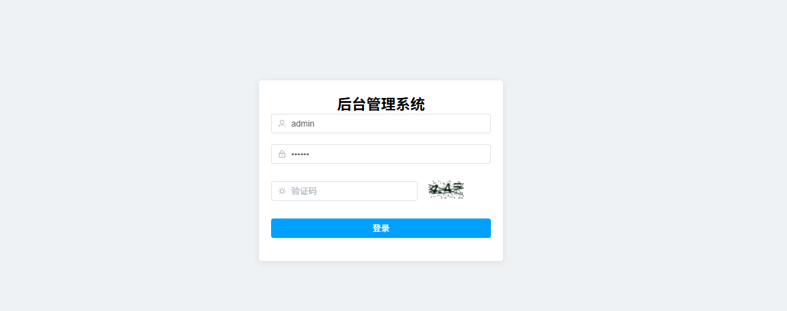

### 仪表盘
系统概览页面，展示关键数据统计、待办任务和系统状态。

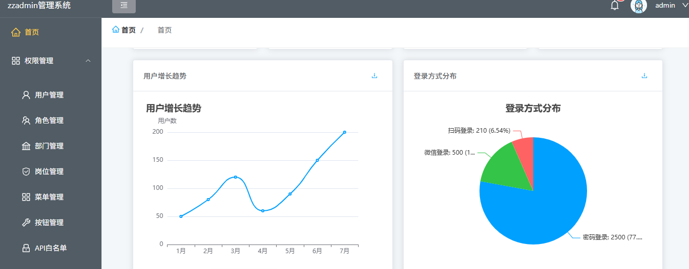

### 用户管理
用户列表、新增、编辑、删除等功能，支持用户状态管理和角色分配。

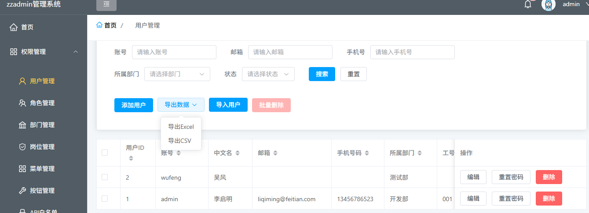

### 角色管理
角色列表、权限配置功能，支持精细化权限控制。

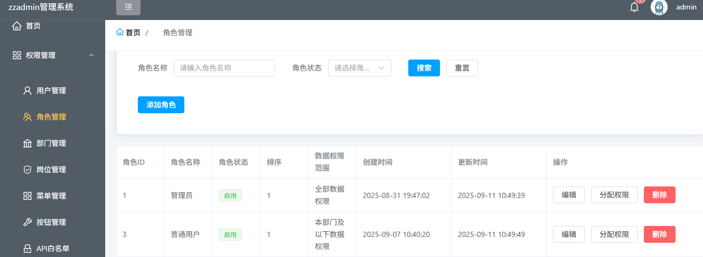

### 部门管理
组织架构展示和管理，支持层级结构。

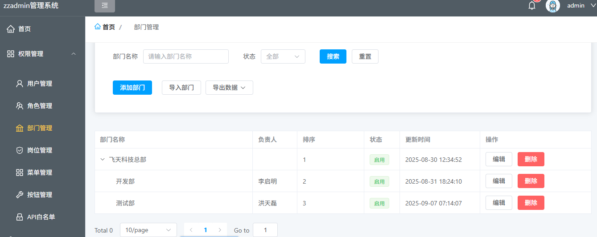

### 菜单管理
系统菜单配置，支持多级菜单和按钮权限设置。

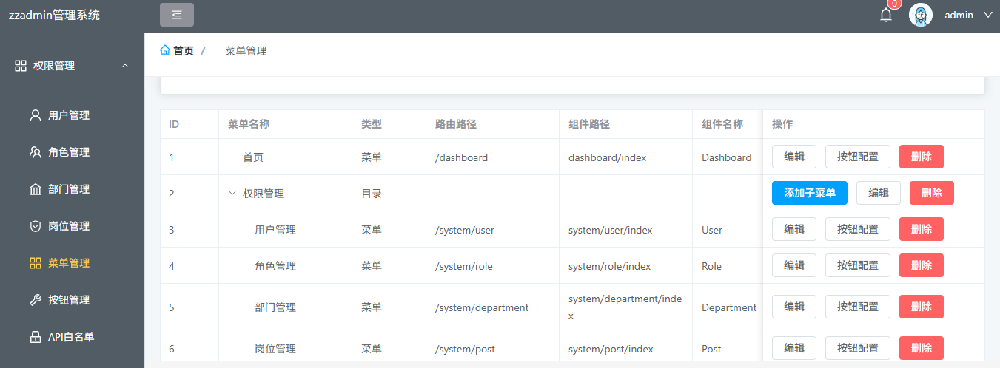

### 文件管理
文件上传、下载和管理功能，支持多种文件格式。

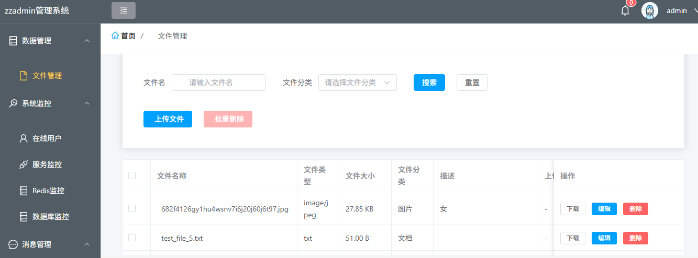

### 系统监控

#### 在线用户
实时显示系统当前登录用户信息和活动状态。

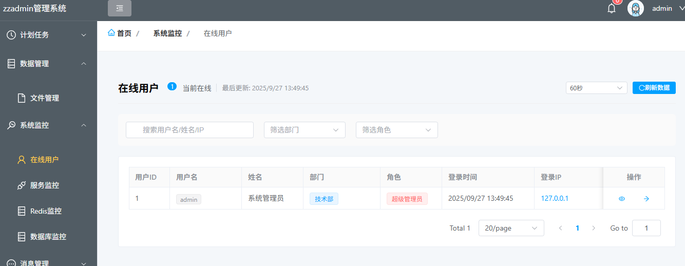

#### 服务监控
系统服务状态和性能指标监控。

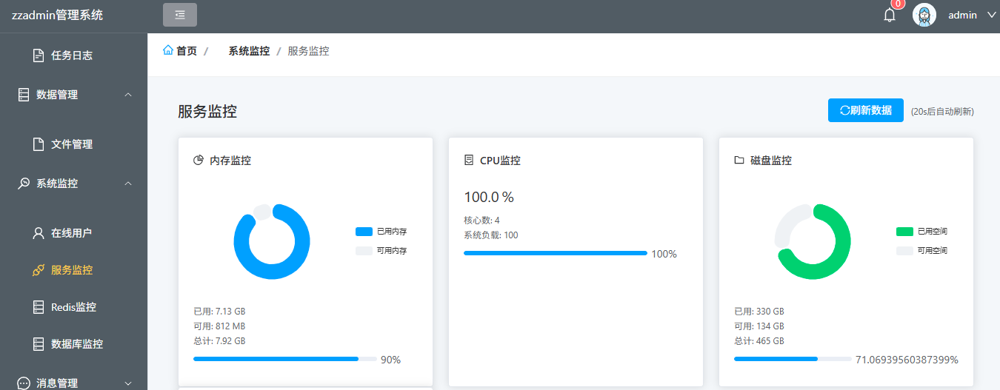

#### Redis监控
Redis缓存服务使用情况和性能监控。

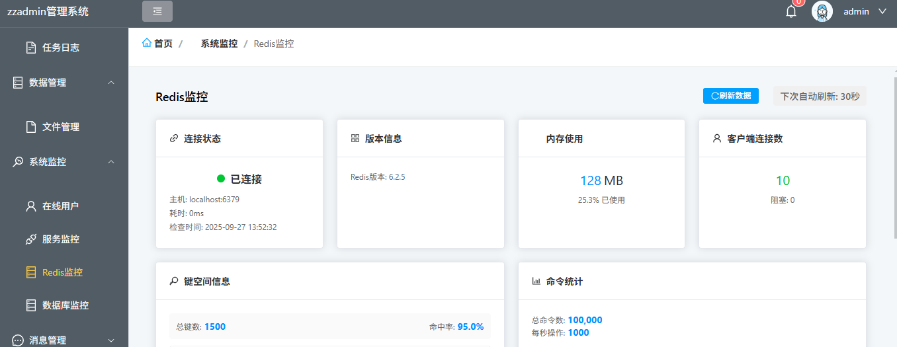

#### 数据库监控
数据库连接池状态和查询性能监控。

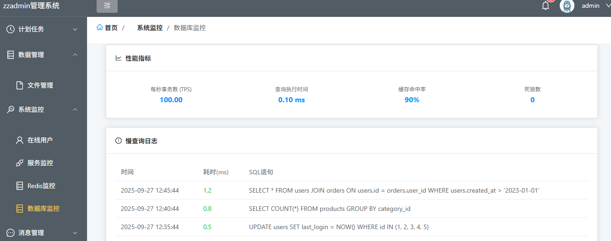

### 岗位管理
系统岗位列表和管理功能，支持岗位分配和权限设置。

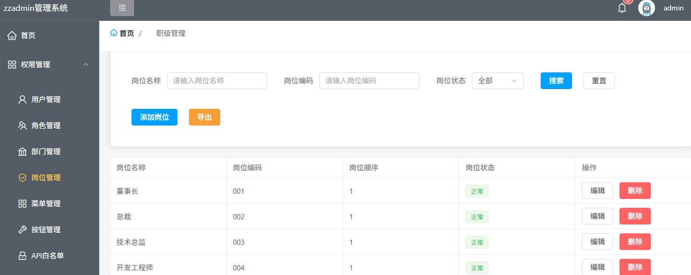

### 按钮管理
系统按钮权限配置和管理。


### API白名单
系统API访问白名单配置和管理。

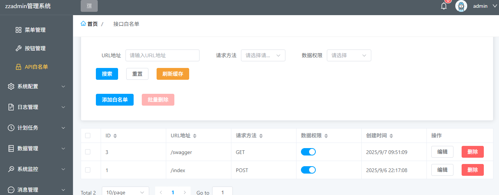

### 字典管理
数据字典配置和维护功能。

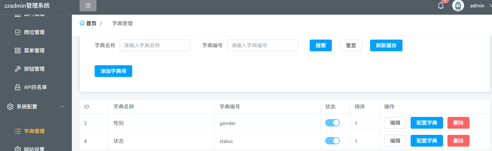

### 操作日志
详细记录系统用户操作行为和变更内容。

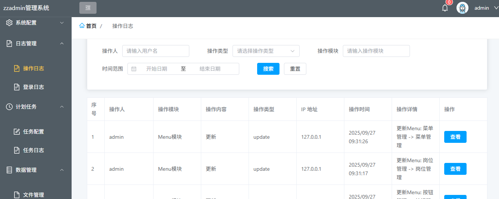

### 登录日志
系统用户登录记录和状态追踪。

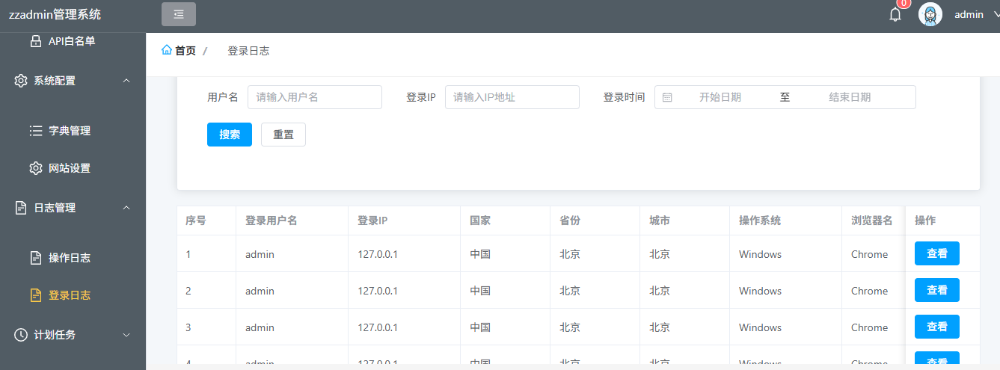

### 任务配置
定时任务的创建、编辑和调度配置。

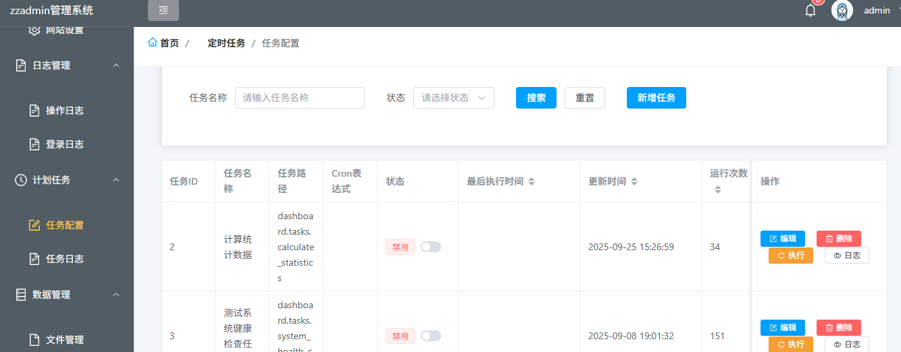

### 任务日志
定时任务的执行记录和结果追踪。

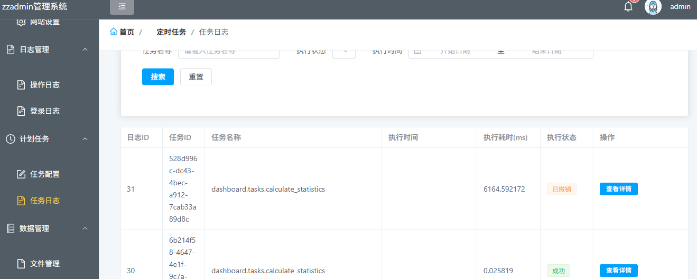

### 消息管理
系统消息的发送、接收和管理。

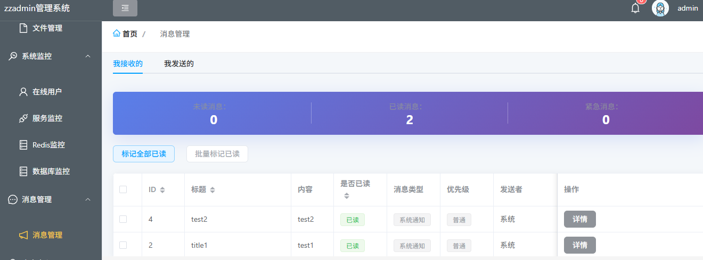
：


## 注意事项
- 开发环境中，API请求默认指向 http://localhost:8000，请根据实际后端地址进行配置
- 生产环境中，请确保配置正确的API地址和环境变量
- 如需对接其他业务系统（如OA、CRM），请参考后端集成文档进行配置

## License
MIT
